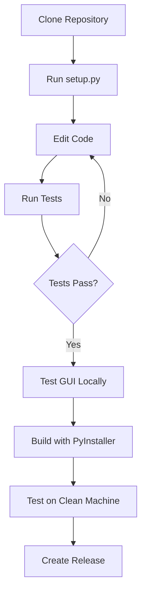

# 📁 Bit Buddy Project Structure

This document explains the organization of the Bit Buddy codebase.

## 📂 Root Directory

```
bit-buddy/
├── README.md                 # Project overview and quick start
├── requirements.txt          # Python dependencies
├── pyproject.toml           # Project metadata and build config
├── setup.py                 # Installation and setup script
├── buddy_gui.py             # Main desktop GUI application
├── installer.py             # System analyzer and installer logic
└── .gitignore               # Git ignore patterns
```

### Key Files

- **`buddy_gui.py`**: The main desktop application. Run this to launch Bit Buddy GUI.
- **`installer.py`**: Analyzes system resources and recommends AI models. Used by setup.
- **`setup.py`**: Interactive setup script for first-time installation.

---

## 📚 Documentation (`docs/`)

```
docs/
├── user/                    # End-user documentation
│   └── END_USER_GUIDE.md   # Installation and usage guide
├── developer/               # Developer documentation
│   ├── QUICKSTART.md       # 5-minute dev setup
│   ├── DEPLOYMENT_SUMMARY.md  # Production readiness checklist
│   └── GITHUB_DEVELOPMENT.md  # Architecture and design principles
└── build/                   # Build system documentation
    └── BUILD_INSTRUCTIONS.md  # How to build installers
```

### Documentation Guide

- **New Users**: Start with `docs/user/END_USER_GUIDE.md`
- **Developers**: Read `docs/developer/QUICKSTART.md` first
- **Building Installers**: Follow `docs/build/BUILD_INSTRUCTIONS.md`

---

## 🔧 Application Core (`app/`)

```
app/
├── __init__.py              # Package initialization
├── config.yaml              # Application configuration
├── server.py                # FastAPI REST API server
├── rag.py                   # RAG engine (document indexing/search)
├── persona.py               # Personality system
├── mesh.py                  # External interface with privacy controls
└── mesh_ext.py              # Persona integration for mesh
```

### Core Components

- **`server.py`**: FastAPI server with endpoints: `/`, `/health`, `/chat`, `/reindex`
- **`rag.py`**: Document processing, embedding generation, semantic search
- **`persona.py`**: Personality traits, narrative arcs, mood system
- **`mesh.py`**: Privacy-first external API with redaction and sharing policies

---

## 🎨 Assets (`assets/`)

```
assets/
├── buddy_icon.png           # Application icon (256x256)
├── buddy_icon.ico           # Windows icon (multi-size)
├── buddy_icon.iconset/      # macOS icon source
├── ICON_GUIDE.md            # Icon creation guide
├── character_selector.py    # Character selection system
└── characters/
    ├── README.md            # Character profiles and personalities
    ├── character_purple_green.png   # Glitch
    ├── character_orange_blue.png    # Citrus
    ├── character_teal_orange.png    # Slate
    └── character_pink_green.png     # Nova
```

### Character System

Each character has unique personality traits that affect:
- Response tone and humor
- Curiosity level
- Formality in communication
- Temperature (response creativity)

---

## 🏗️ Build System (`build/`)

```
build/
└── config/
    ├── buddy.spec           # PyInstaller configuration
    └── BitBuddyInstaller.iss  # Inno Setup (Windows installer)
```

### Building Executables

**Windows:**
```bash
pyinstaller build/config/buddy.spec
iscc build/config/BitBuddyInstaller.iss
```

**macOS:**
```bash
pyinstaller build/config/buddy.spec
# Creates BitBuddy.app
```

---

## 🛠️ Development Tools (`tools/`)

```
tools/
├── cleanup.sh               # Clean build artifacts and stop processes
├── pre_build_test.py        # Pre-build validation suite (12 tests)
├── generate_icon.py         # Icon generator with personality themes
├── debug_tools.py           # Development debugging utilities
├── deploy.py                # Deployment automation
├── test_runner.py           # Test execution wrapper
└── docker-mesh-test.sh      # Docker testing for mesh network
```

### Tool Usage

- **Before building**: Run `python tools/pre_build_test.py`
- **Clean workspace**: Run `./tools/cleanup.sh`
- **Generate icons**: Run `python tools/generate_icon.py`

---

## 🗄️ User Data (`custodian/`)

```
custodian/
├── manifest.yaml            # Custodian metadata
├── policy.yaml              # Privacy and sharing policies
├── persona.yaml             # Persistent personality state
├── peers.json               # Network peer connections
└── story.md                 # Narrative journal
```

### User Data Location

- **Development**: `./custodian/`
- **Production (Windows)**: `%APPDATA%\BitBuddy\`
- **Production (macOS)**: `~/Library/Application Support/BitBuddy/`
- **Production (Linux)**: `~/.config/BitBuddy/`

---

## 📝 PowerShell Scripts (`scripts/`)

```
scripts/
├── serve.ps1                # Start FastAPI server
├── index.ps1                # Rebuild RAG index
├── persona.init.ps1         # Initialize new persona
├── persona.randomize.ps1    # Generate random personality
├── persona.set.ps1          # Update personality traits
├── mesh.ps1                 # Mesh network operations
├── add-peer.ps1             # Add network peer
├── rotate-key.ps1           # Rotate security key
├── setup.ps1                # Windows setup script
├── start-llamacpp-server.ps1  # Start llama.cpp backend
└── upgrade.ps1              # Update dependencies
```

### Script Usage (Windows)

```powershell
# Start server
.\scripts\serve.ps1

# Randomize personality
.\scripts\persona.randomize.ps1

# Rebuild index
.\scripts\index.ps1
```

---

## 🧪 Tests (`tests/`)

```
tests/
├── __init__.py
└── test_buddy_system.py     # System integration tests
```

### Running Tests

```bash
# Run all tests
pytest tests/

# Run with coverage
pytest --cov=app tests/

# Run pre-build validation
python tools/pre_build_test.py
```

---

## 🚀 MVP Prototype (`mvp/`)

```
mvp/
├── README.md                # MVP documentation
├── IMPLEMENTATION.md        # Implementation notes
├── MICROLLM_STRATEGY.md     # Micro-LLM approach
├── bit_buddy.py             # Prototype buddy class
├── microllm_brain.py        # Prototype LLM integration
├── demo.py                  # Demo script
├── validate_concept.py      # Concept validation
├── server.py                # Prototype server
└── requirements.txt         # MVP-specific dependencies
```

**Note**: MVP is a proof-of-concept. Production code is in `app/` and `buddy_gui.py`.

---

## 📦 Distribution Files

```
dist/                        # Built executables (generated)
├── BitBuddy.exe            # Windows executable
├── BitBuddy.app/           # macOS application bundle
└── installer/
    └── BitBuddySetup-1.0.0.exe  # Windows installer
```

**Note**: `dist/` is generated by PyInstaller and should not be committed to git.

---

## 🔍 Index Data (`index/`)

```
index/
├── embeddings.npy           # Vector embeddings for semantic search
└── meta.jsonl               # Metadata for each indexed chunk
```

**Note**: This is generated data and can be rebuilt with `/reindex` endpoint.

---

## 📚 Knowledge Base (`kb/`)

```
kb/                          # User documents to index
└── (user files)            # PDF, DOCX, TXT, MD files
```

**Note**: Add your documents here and run `/reindex` to make them searchable.

---

## 🚫 Excluded from Repository

The following are auto-generated or environment-specific:

```
.venv/                       # Python virtual environment
venv/                        # Alternative venv location
__pycache__/                 # Python bytecode cache
*.pyc                        # Compiled Python files
build/                       # PyInstaller build artifacts
dist/                        # Distribution files
*.egg-info/                  # Package metadata
.pytest_cache/               # Pytest cache
.coverage                    # Coverage reports
node_modules/                # Node dependencies (if any)
```

---

## 🗂️ File Type Reference

| Extension | Purpose | Location |
|-----------|---------|----------|
| `.py` | Python source code | Root, `app/`, `tools/`, `tests/` |
| `.yaml` / `.yml` | Configuration files | `app/`, `custodian/` |
| `.json` | Data files | `custodian/` |
| `.md` | Documentation | `docs/`, Root |
| `.ps1` | PowerShell scripts | `scripts/` |
| `.sh` | Bash scripts | `tools/` |
| `.spec` | PyInstaller config | `build/config/` |
| `.iss` | Inno Setup config | `build/config/` |
| `.png` / `.ico` / `.icns` | Icons/Images | `assets/` |

---

## 🎯 Quick Navigation

### I want to...

**...run the app locally**  
→ `python buddy_gui.py`

**...start the API server**  
→ `uvicorn app.server:app --reload`

**...build an installer**  
→ See `docs/build/BUILD_INSTRUCTIONS.md`

**...add a new document**  
→ Copy to `kb/` folder, then POST to `/reindex`

**...customize my buddy's personality**  
→ Edit `custodian/persona.yaml` or use `scripts/persona.set.ps1`

**...run tests**  
→ `pytest tests/` or `python tools/pre_build_test.py`

**...contribute**  
→ Read `docs/developer/GITHUB_DEVELOPMENT.md`

---

## 📈 Development Workflow



---

## 🤝 Contributing

When adding new features:

1. **Core functionality** → `app/`
2. **User interface** → `buddy_gui.py`
3. **Build tools** → `tools/`
4. **Documentation** → `docs/`
5. **Tests** → `tests/`

Always run `python tools/pre_build_test.py` before committing!

---

**Last Updated**: October 30, 2025  
**Version**: 1.0.0
