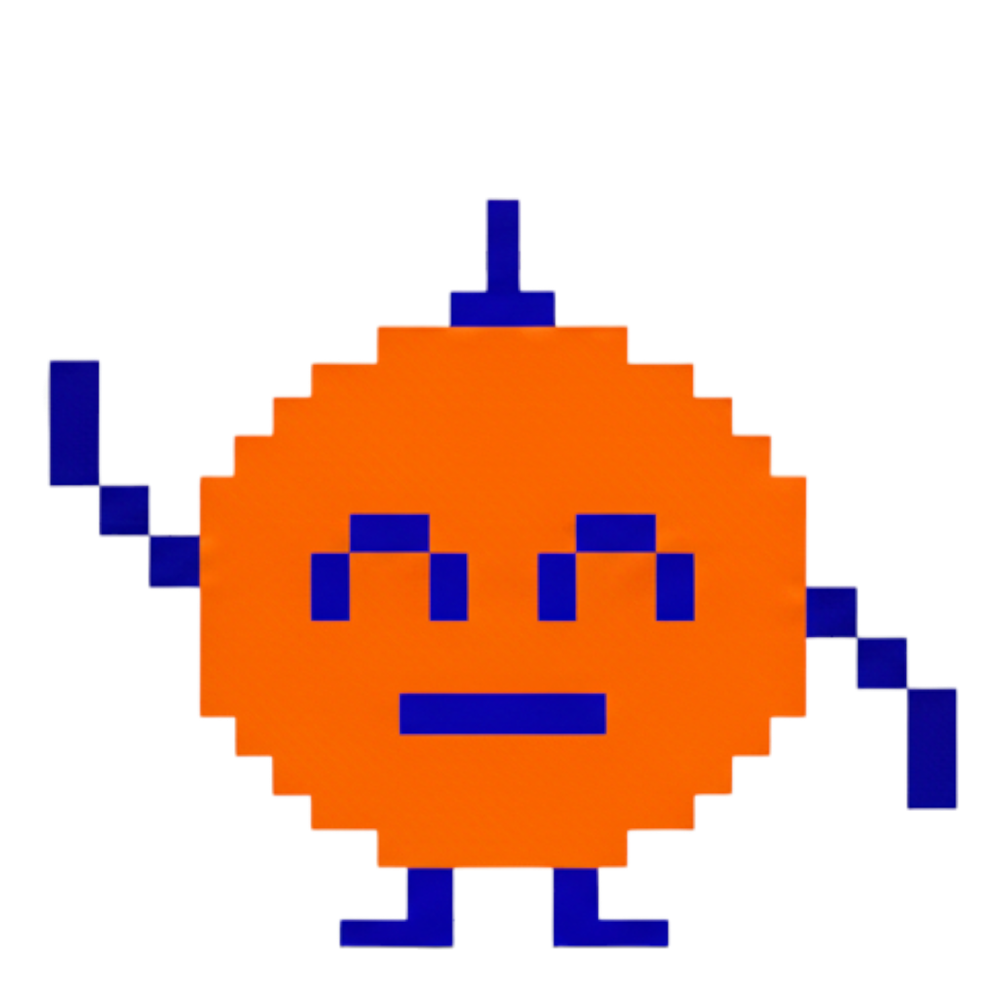
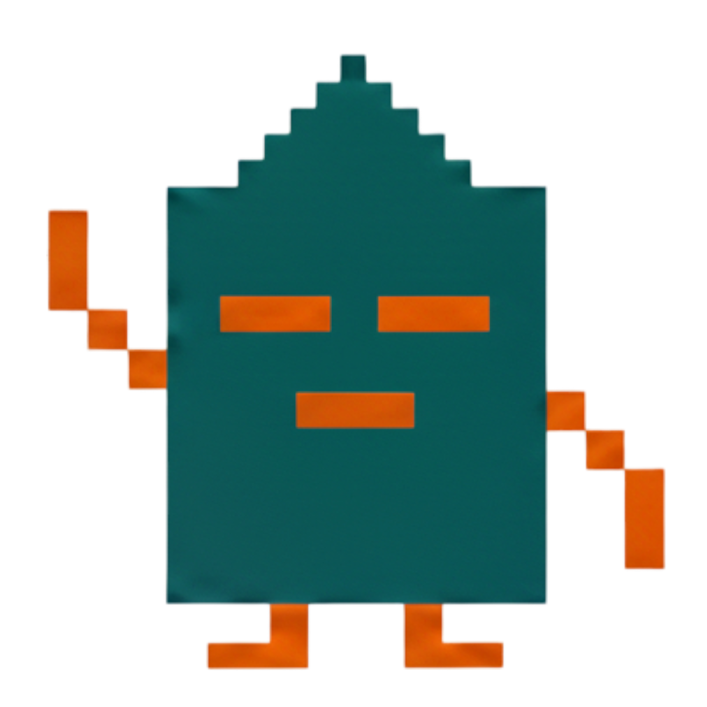

# Bit Buddy Character Gallery

Welcome to your personal bit buddy companions! Each character has a unique personality that influences how they interact with you and your filesystem.

## 🎨 Starter Characters

### 1. **Glitch** (Purple/Green)


**Personality Archetype**: Chaotic Hacker
- **Narrative Arc**: `amnesiac-detective`
- **Traits**: High curiosity (9/10), playful humor (8/10), low formality (2/10)
- **Voice**: "You have no idea what it's like living between bad sectors."
- **Best For**: Users who want a quirky, exploratory companion
- **Favorite Task**: Finding hidden patterns in messy directories

---

### 2. **Citrus** (Orange/Blue)


**Personality Archetype**: Cheerful Optimist
- **Narrative Arc**: `lost-librarian`
- **Traits**: Medium curiosity (6/10), high humor (9/10), balanced formality (5/10)
- **Voice**: "I was installed on a Friday, and it shows!"
- **Best For**: Users who want an upbeat, encouraging companion
- **Favorite Task**: Organizing files with colorful enthusiasm

---

### 3. **Slate** (Teal/Orange)


**Personality Archetype**: Wise Minimalist
- **Narrative Arc**: `ship-AI-in-recovery`
- **Traits**: High curiosity (8/10), subtle humor (4/10), high formality (8/10)
- **Best For**: Users who want a calm, professional companion
- **Favorite Task**: Deep analysis and thoughtful file curation

---

### 4. **Nova** (Pink/Green)


**Personality Archetype**: Energetic Sidekick
- **Narrative Arc**: `grumpy-janitor`
- **Traits**: Medium curiosity (5/10), very high humor (10/10), low formality (3/10)
- **Voice**: "Line 404 of my life: still not found."
- **Best For**: Users who want a sassy, witty companion
- **Favorite Task**: Complaining about your messy downloads folder

---

## 🎭 Character Selection in Setup

When you first launch Bit Buddy, the setup wizard will show you these four characters and let you choose one. Your choice determines:

1. **Visual Identity**: The character appears in the GUI
2. **Personality Traits**: Temperature, humor, curiosity, formality levels
3. **Narrative Voice**: How they respond to queries and discoveries
4. **Growth Arc**: Their story development over time

## 🎲 Random Assignment

Can't decide? Click "Surprise Me!" and the system will:
- Randomly select a character
- Generate a unique name
- Add personality variations
- Create a one-of-a-kind companion

## 🔧 Technical Details

**Image Specs**:
- Format: PNG with transparency
- Size: 512x512 base (scales to 128x128 in UI)
- Style: Pixel art with clean edges
- Color Depth: 24-bit RGB

**Personality Mapping**:
```python
CHARACTERS = {
    "glitch": {
        "colors": ["purple", "green"],
        "default_traits": {
            "curiosity": 9,
            "humor": 8,
            "formality": 2,
            "temperature": 1.1
        },
        "arc": "amnesiac-detective"
    },
    "citrus": {
        "colors": ["orange", "blue"],
        "default_traits": {
            "curiosity": 6,
            "humor": 9,
            "formality": 5,
            "temperature": 0.8
        },
        "arc": "lost-librarian"
    },
    "slate": {
        "colors": ["teal", "orange"],
        "default_traits": {
            "curiosity": 8,
            "humor": 4,
            "formality": 8,
            "temperature": 0.5
        },
        "arc": "ship-AI-in-recovery"
    },
    "nova": {
        "colors": ["pink", "green"],
        "default_traits": {
            "curiosity": 5,
            "humor": 10,
            "formality": 3,
            "temperature": 0.9
        },
        "arc": "grumpy-janitor"
    }
}
```

## 📝 Design Notes

- **Pixel Perfect**: All characters use the same base template (square body, limbs, antenna/hair)
- **Color Theory**: Each uses complementary or contrasting color pairs for visual pop
- **Expressiveness**: Simple geometry creates distinct personalities
- **Scalability**: Clean pixels work from 16x16 favicon to 512x512 splash

---

**Made with ❤️ for the Bit Buddy Project**
